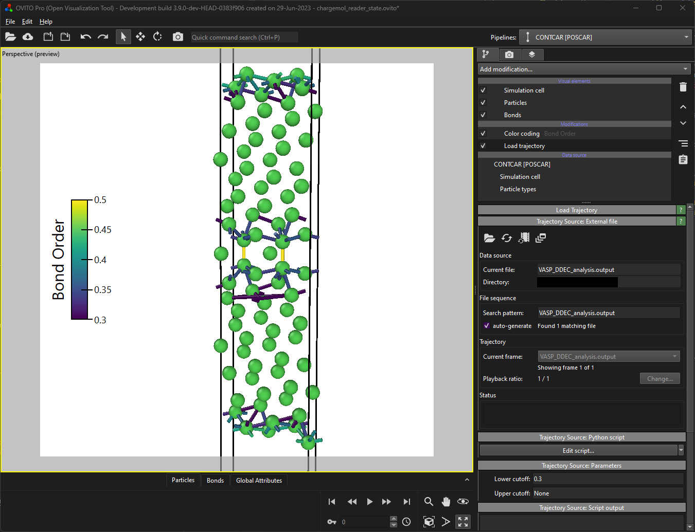

# Chargemol Bonds Reader
OVITO Python file reader for the DDEC analysis output written by chargemol.

## Description
Python file reader for *OVITO* that reads the *bond topology* from a DDEC chargemol analysis. To use
it you first need to load the particles from a CONTCAR, POSCAR, or XDATCAR file. Afterwards, you can
read the bonds topology file using the  [*load trajectory modifier*](https://www.ovito.org/docs/current/reference/pipelines/modifiers/load_trajectory.html#particles-modifiers-load-trajectory).   
Note, that this file reader will only produce correct results if the chargemol file was calculated
based on the structure initally loaded into OVITO. 
This file reader currently only reads the bond topology and bond order from the chargemol file.

## Parameters
- `lowerCutoff` / "Lower cutoff": Defines a lower cutoff value for the bond order. All bonds below this
  threshold will not be imported by the bonds reader. If it is set to `None` no lower cutoff will be
  applied. Defaults to `None`.
- `upperCutoff` / "Upper cutoff": Defines an upper cutoff value for the bond order. All bonds above this
  threshold will not be imported by the bonds reader. If it is set to `None` no upper cutoff will be
  applied. Defaults to `None`.

## Example
The following image shows this file reader used in a *load trajectory modifier* in the *OVITO PRO*
desktop application. The lower cutoff parameter is set to 0.3, while the upper cutoff value is set
to `None`. Therefore, all bonds above a bond order value of 0.3 are loaded and added to scene
already containing the correct CONTCAR structure file.



## Installation
- OVITO PRO built-in Python interpreter
```
ovitos -m pip install --user git+https://github.com/nnn911/ChargemolBondsReader.git
``` 
- Standalone Python package or Conda environment
```
pip install --user git+https://github.com/nnn911/ChargemolBondsReader.git
```
- Please note that the `--user` tag is recommended but optional and depends on your Python installation.

## Technical information / dependencies
- Tested on OVITO version 3.9.0
- Chargemol version 3.5

## Contact
- Daniel Utt (utt@ovito.org)
